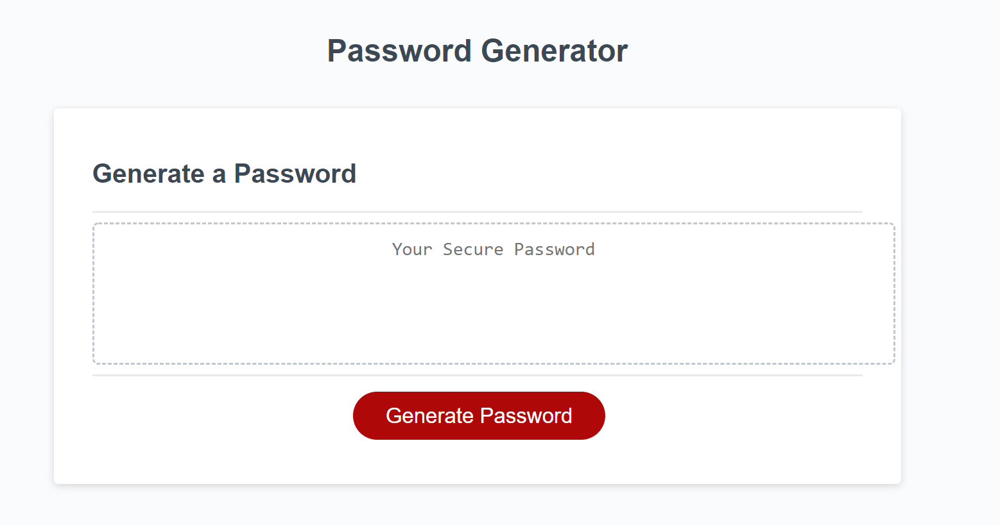
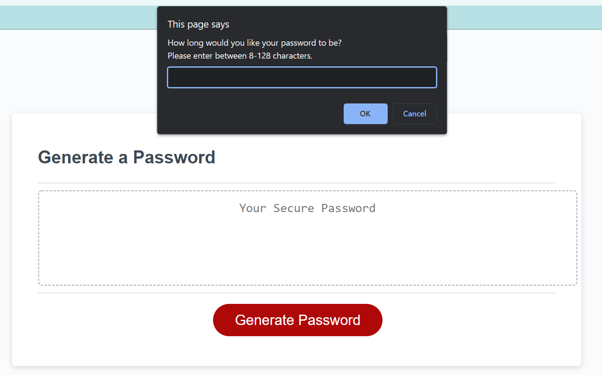
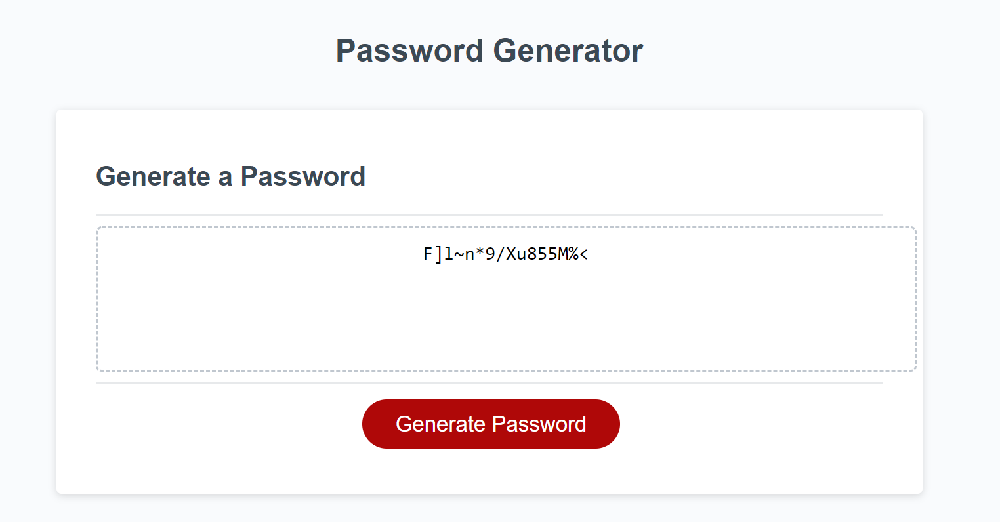

# Homework 03 - Javscript Password Generator

## The Objective

The purpose of this code is to generate a random, secure password. This password is generated by prompting users for several criteria. This criteria includes:

- Desired password length
- Whether uppercase characters should be included
- Whether lowercase characters should be included
- Whether numbers should be included
- Whether special characters should be included

The user's input is validated at each step to ensure they are making a valid selection. We ensure that the user has selected at least one character type to include in their password and that their password length is at least 8 characters and no more than 128 characters.

## Web Application Screenshots

### We begin by letting the user click a generate password button.

### Then, we prompt for user input, giving them a list of criteria for us to validate against.

### Once all user input is taken in, we randomly generate a password based on the user's input and display it in the HTML content on the webpage.

